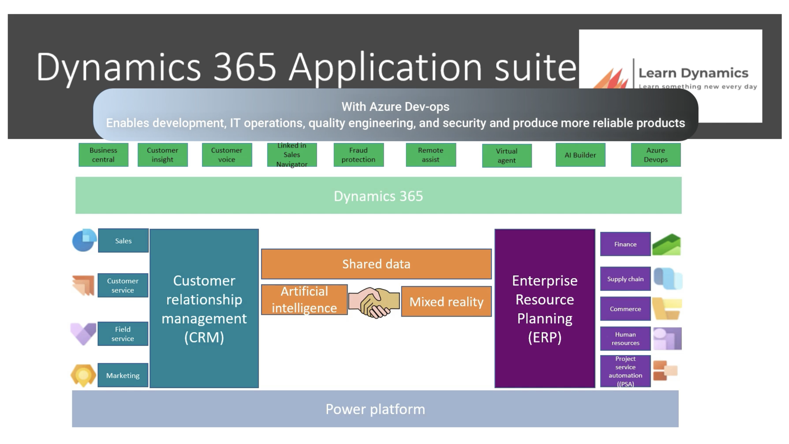
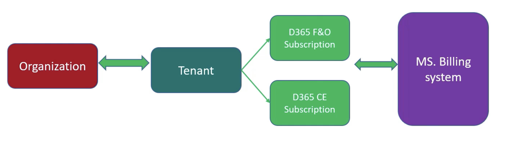
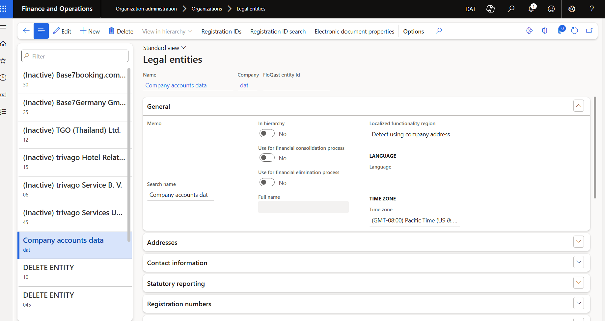
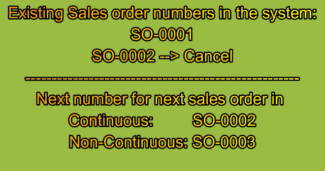
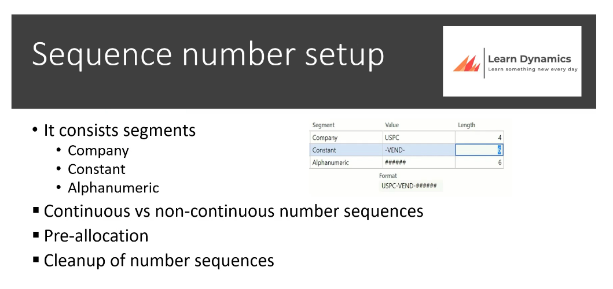

It's offered in the Cloud by Microsoft. So each organization is considered as a tenant.

https://learn.microsoft.com/en-us/credentials/certifications/d365-functional-consultant-financials/?practice-assessment-type=certification

LAB for online trials : https://learn.microsoft.com/en-us/training/modules/get-started-financial-management-dyn365-finance/12-1-exercise?ns-enrollment-type=learningpath&ns-enrollment-id=learn.wwl.set-up-configure-financial-management-work-general-ledger

Options tab on module for selection

WORKSPACES
________
1. Workspace is a one stop-shop for specific activities.
2. 360-degree view of activities : No need to navigate to multiple list
3. Answer specific questions  : Questions such as : 
        Are there urgent cases that need to be attended
        How difficult will my workload be ? 
        Are cases easy or difficult to solve ?
4. Provide insight : Compare multiple sources of data. Provide a big picture view that might be difficult to achieve when only looking at lists in specific modules.
5. Navigates by data : Less time spent filtering to find results
6. Direct access to tasks: Tasks can be performed directly from the workspace

*Customer Payment module

##### Legal Entity 

A legal entity is usually called the company organization branches. They are the list of available companies or branches within the Company or Organization.

We can also change the company image, logo, address etc there too. So go through the sub tabs.

###### Sequence Number Definition 

It's a unique identifier for each record in the system such as Customers, Vendors, Transactions or other transaction within the System. So in general, number sequences in finance and operations apps are used to generate readable, unique identifiers for master data records and transaction records that require identifiers such as customers,vendors, sales orders, purchase orders or any other transactions within the system. 

Each module specific parameter page has a reference to the sequence number that is define for that specific module.

You should specify the scope for sequence numbers.
    - Shared : A single number sequence is used for all organizations. The Shared scope is available only for some references.
    - Legal Entity : A separate number sequence is used for each company.

It consists segments
   - Company
   - Constant 
   - Alphanumeric : # for incremental numbers , & for incremental letters
  

Number sequence can be continuous or non-continuous. A continuous number sequence can skip numbers but numbers will be used sequentially. 

Continuous sequence numbers are not recommended as they have a large impact on system performance. Continuous number sequences are typically required for external documents such as purchase orders however continuous number sequences can adversely affect system response times because the system must request a number from a database every time that a new document or record is created. 

If you use a non-continuous sequence sequence, you can enable Pre-allocation on the performance tab on the number sequence page. New numbers are requested from DB only after the pre allocated quantity has been used. 

In case of a power failure, an application error or other unexpected failure, F&O apps cannot recycle numbers automatically for continuous number sequences. You can run the cleanup process manually to recover the lost numbers. 

