DOCUMENTATION : https://learn.microsoft.com/en-us/dynamics365/finance/

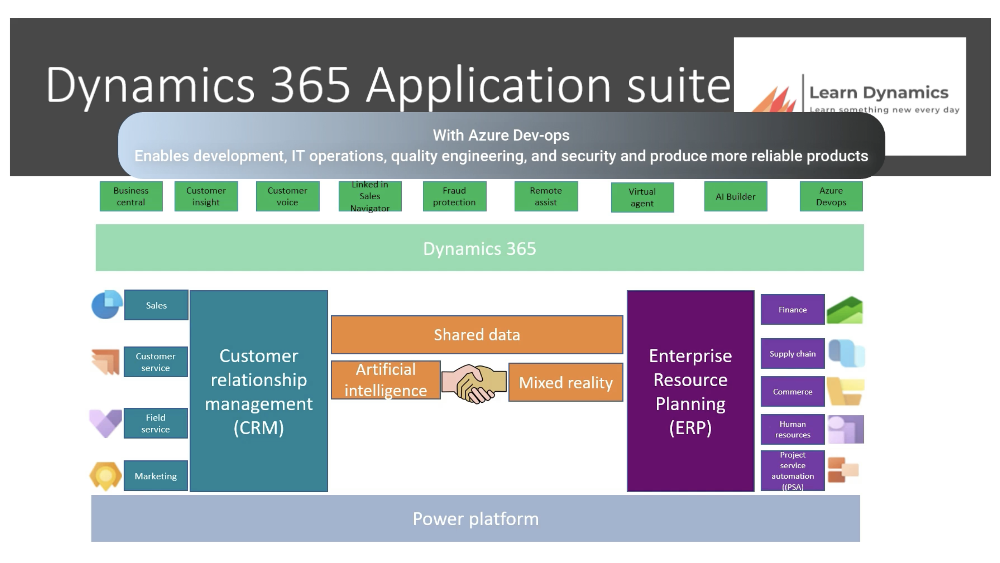

It's offered in the Cloud by Microsoft. So each organization is considered as a tenant.

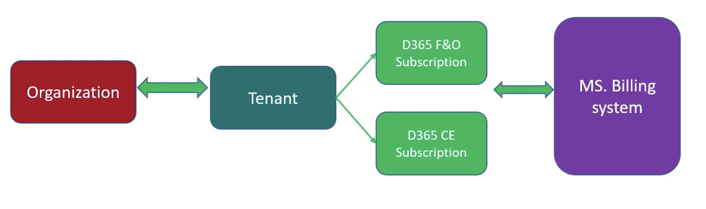

https://learn.microsoft.com/en-us/credentials/certifications/d365-functional-consultant-financials/?practice-assessment-type=certification


LAB for online trials : https://learn.microsoft.com/en-us/training/modules/get-started-financial-management-dyn365-finance/12-1-exercise?ns-enrollment-type=learningpath&ns-enrollment-id=learn.wwl.set-up-configure-financial-management-work-general-ledger

Options tab on module for selection


WORKSPACES
________
1. Workspace is a one stop-shop for specific activities.
2. 360-degree view of activities : No need to navigate to multiple list
3. Answer specific questions  : Questions such as : 
        Are there urgent cases that need to be attended
        How difficult will my workload be ? 
        Are cases easy or difficult to solve ?
4. Provide insight : Compare multiple sources of data. Provide a big picture view that might be difficult to achieve when only looking at lists in specific modules.
5. Navigates by data : Less time spent filtering to find results
6. Direct access to tasks: Tasks can be performed directly from the workspace


*Customer Payment module


##### Legal Entity 

A legal entity is usually called the company organization branches. They are the list of available companies or branches within the Company or Organization.

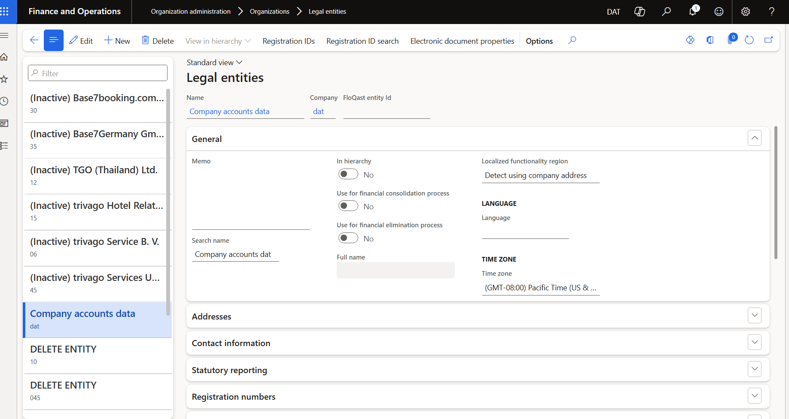

We can also change the company image, logo, address etc there too. So go through the sub tabs.

###### Sequence Number Definition 

It's a unique identifier for each record in the system such as Customers, Vendors, Transactions or other transaction within the System. So in general, number sequences in finance and operations apps are used to generate readable, unique identifiers for master data records and transaction records that require identifiers such as customers,vendors, sales orders, purchase orders or any other transactions within the system. 

Each module specific parameter page has a reference to the sequence number that is define for that specific module.

You should specify the scope for sequence numbers.
    - Shared : A single number sequence is used for all organizations. The Shared scope is available only for some references.
    - Legal Entity : A separate number sequence is used for each company.

It consists segments
   - Company
   - Constant 
   - Alphanumeric : # for incremental numbers , & for incremental letters
  

Number sequence can be continuous or non-continuous. A continuous number sequence can skip numbers but numbers will be used sequentially. 

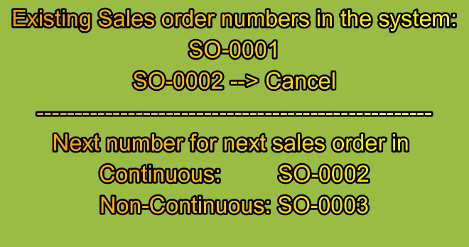

Continuous sequence numbers are not recommended as they have a large impact on system performance. Continuous number sequences are typically required for external documents such as purchase orders however continuous number sequences can adversely affect system response times because the system must request a number from a database every time that a new document or record is created. 

If you use a non-continuous sequence sequence, you can enable Pre-allocation on the performance tab on the number sequence page. New numbers are requested from DB only after the pre allocated quantity has been used. 

In case of a power failure, an application error or other unexpected failure, F&O apps cannot recycle numbers automatically for continuous number sequences. You can run the cleanup process manually to recover the lost numbers. 

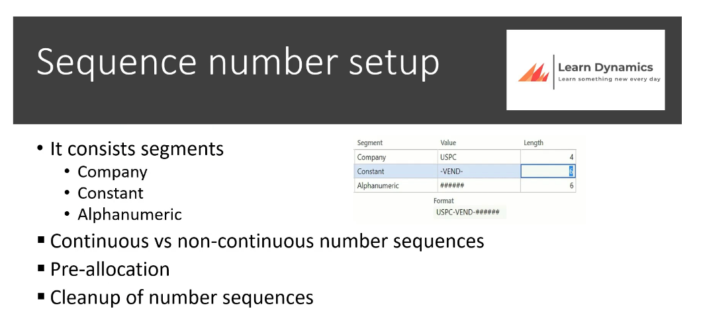

Each module have their own number sequence setup. See for Account Payable. 

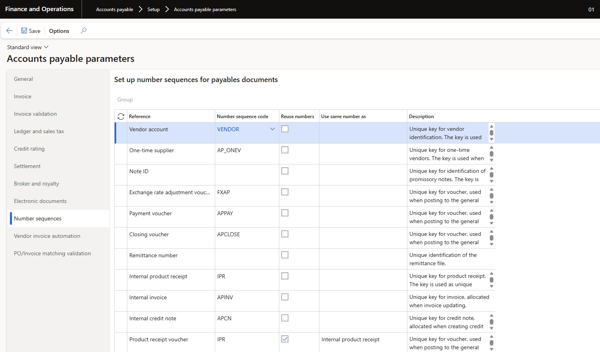

To speed up setup it's better to use the Number Sequence Wizard to set up the number sequence as there are lots of sequence to setup in the System. 

##### GLOBAL ADDRESS BOOK

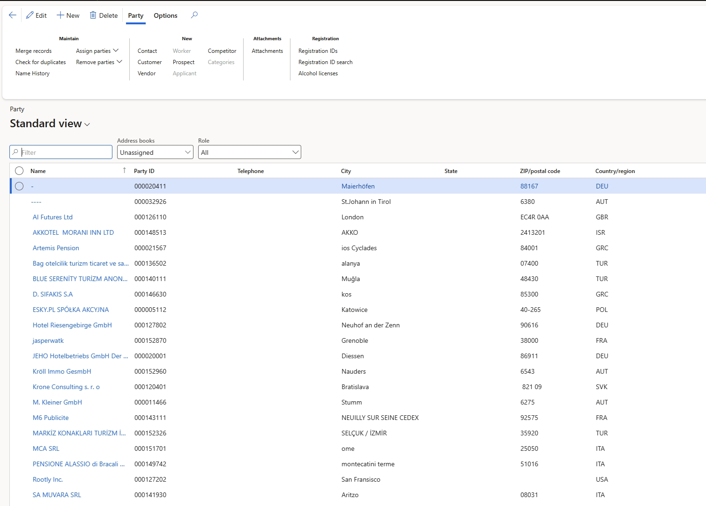

The Global address book is a centralized repository for master data that must be stored for all internal and external persons and 
organizations that the company interacts with. So that means when an address changes the update only needs to be made in one place all the other associated records are updated automatically. 

Customers : Individuals or companies who purchase goods or services from your organization.   

Prospects : A party that might provide a service or benefits to a legal entity.  

Worker : A person who is assumed as an employee.  

Vendor : A party that supply products to one or more legal entities in exchange for payments.  

Competitor : A person or organization that provides goods or services similar to yours. 

Application : A person who makes a formal written request to work in an organization.  

Contact : A person inside or outside your organization that you have created in your organization.

>>> Organization Administration > Global Address Book

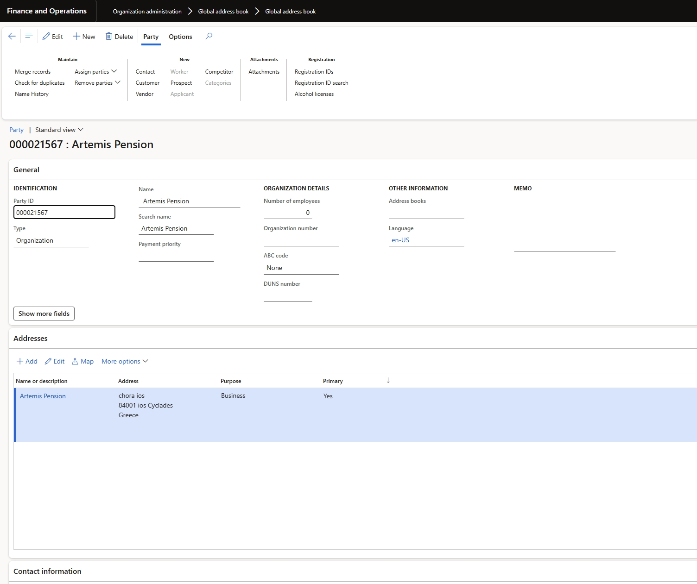

We can click on the NEW to create a new party. 

If we decide to create the Vendor or Customer directly from the Accounts payable/receivable module, the corresponding party record is also created within the System in the Global Address Book.   


##### SECURITY MANAGEMENT IN D365F&O

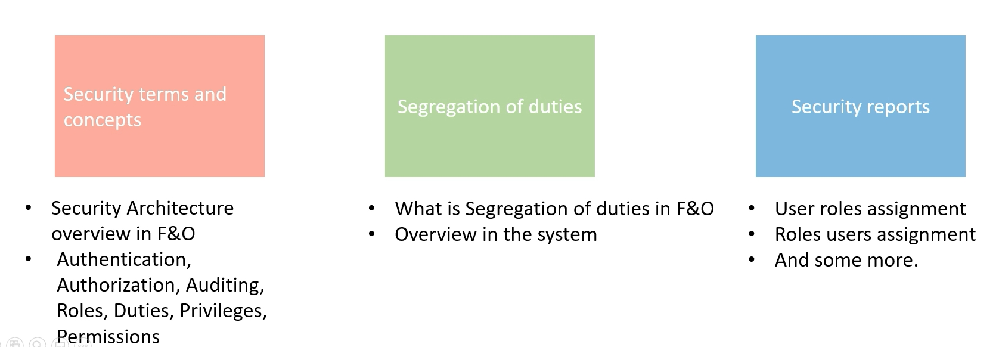

Security Architecture in F&0
_____

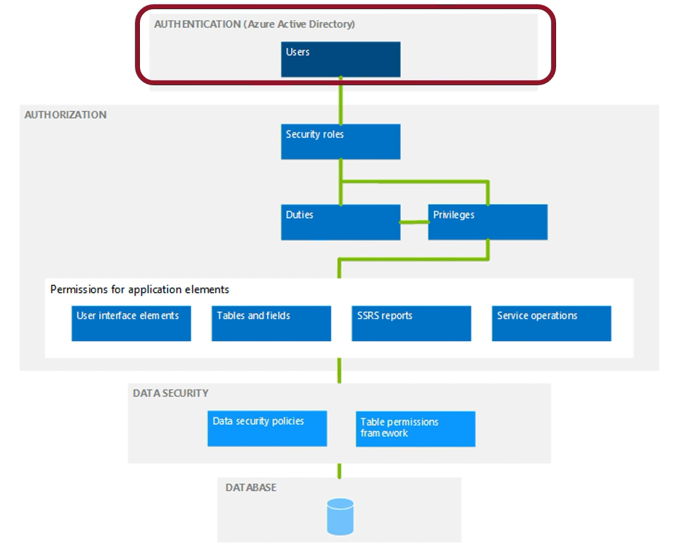   

Authorization grants access but Data security denies access from tables fields, rows in the database.

Data Security for specific tables is enforced by Application Object Server (AOS).  

Auditing of user sign in and sign out is enabled, which means that the system logs when a user signs in or out of the application.

A sign out is logged even if the user's session expires or ends. 

A system administrator or security administrator can access the audit logs by going to the User log page.

>> System Administration > Inquiries > User log   

#### ROLE 

D365F&O uses a ROLE based security architecture. That means users are assigned to security roles based on their responsibilities in the organization and their participation in business processes.

Role based security is aligned with the structure of the business, it means that users are assigned to security roles based on their responsibilities in the organization and their participation in business processes.

In Role based security access is not granted to individual users only to security roles. Users are assigned to Roles then the Admin grants access to the duties that the users in a Role performs. 

Duty correspond to parts of a business process. The Administrator assigns duties to security roles and not in program elements that users wants to use. A duty can be assigned to more than one role and in D365FO duties contains privileges.

For example, the Maintain bank transactions duty contains 
- the generate deposit slips and 
- cancel payments privileges.

Both duties and privilege can be assigned  to security roles. However, it is recommended that you use duties to grant access to finance and operations apps. 

A Privilege specifies the level of access that is required to perform a job, solve a problem or complete an assignment. It also contains permissions to individual application objects such as user interface elements and tables.

For examples, the Cancel payments privilege contains permissions to the menu items, fields and tables that are required to cancel payments. 

By default, privileges are provided for all features in finance and operations apps. The Admin can modify the permissions that are associated with the privilege or create new privileges. 

Permission represents the access to individual objects such as menu items, tables , forms , services or reports.


Each function in FO apps such as a form or a service, is accessed through an entry point.

Entry Point : Menu items, web content items and service operations are referred to collectively as entry points. 

##### Implement and Configure Security Roles.

>> System Administration > Users

We can also see the users online, user log.


We can also the AOT name in the screenshot which stands for APPLICATION OBJECT TREE (AOT). 

The Application Object Tree (AOT) contains all of the definitions of elements that are used to build Microsoft
Dynamics 365 F&O, such as classes, tables, forms and so on. 

So for the time that you are developing to extend the application within the code, if you want to access this particular for example role, you should use a AOT name and not the display name that you see in the role list.


The plus + in the References means the Role has been setup for it. So when you click any item in the References you will see what it has access to. 

SOX -> Sarbanes Oxley International Financial Reporting Standards.

##### SEGREGATION OF DUTIES

This means that a duty that should not be performed by one person to prevent fraud which is a SOX compliance issue too.


In above Sarah cannot be generating receipts and also process payment to vendor as this mean Sarah can forge the receipt without even processing the payments.


So D365FO allows us to configure 2 duty that cannot or should not be done by 1 person. So you cannot have the first duty and also have the second duty as a single person. 

We use Segregation of Duty in D365FO as shown above.


>> System administration > Security > Segregation of duties > Segregation of duties rules

Under the Segregation of duties sub menu, we can also see the list of those in the SOD conflicts and also Verify Compliance of User-Role Assignments.

```
Segregation of duties unresolved conflicts   
Verify compliance of user-role assignments
```

##### SECURITY REPORTS
It can be found under System Administrations > Inquiries > Security

Then we use the RECORDS TO INCLUDE to filter the employees we want to extract.

See sample file [User role assignments.pdf](User role assignments.pdf)

Security Role Access : provides a view of the effective permissions for each security role.

###### WORK WITH WORKFLOWS IN F&O

A workflow represents a business process. It defines how a document flows or moves through the system by showing who must complete a task, make a decision either by using a manual or conditional decision controls, or approve a document.

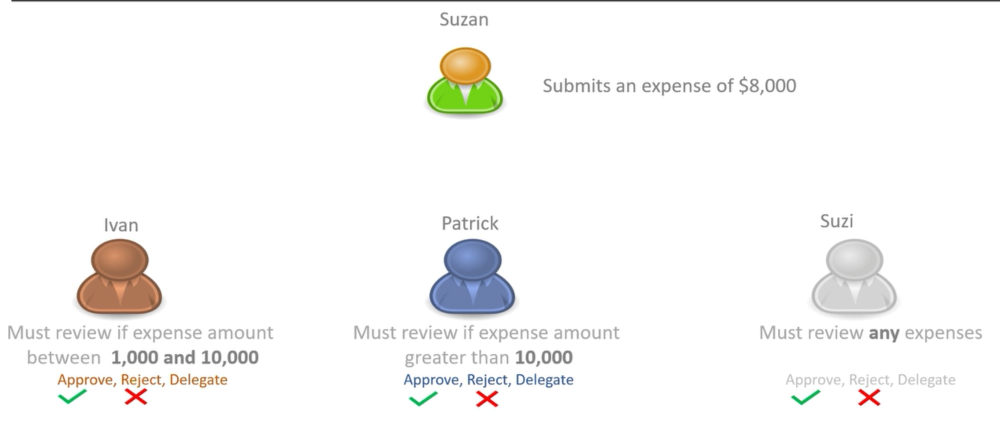

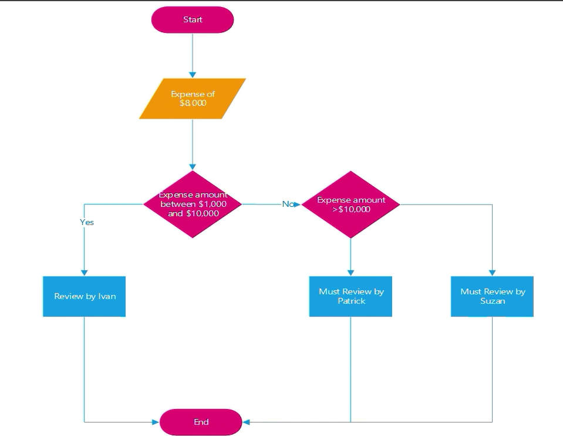

Workflow Types
_____
- A workflow configuration is based on a workflow type.
- You can create multiple workflow configurations for each workflow type.
- Workflow types are available for numerous modules throughout the system.
- You can develop new workflows and extend F&O apps using Visual Studio.
- Before developing a new workflow make sure you've checked all available workflow types.

Some modules that contains workflow types templates out of the box.
- General ledger 
- Accounts payable
- Accounts receivable
- Budgeting 
- Fixed asset
- HR
- Procurement and Sourcing
- Inventory Management
- Project and Accounting
- Time and Attendance
- Cash and Bank
- Commerce

https://learn.microsoft.com/en-us/previous-versions/dynamicsax-2012/appuser-itpro/workflow-types

Let's try a sample in Procurement.

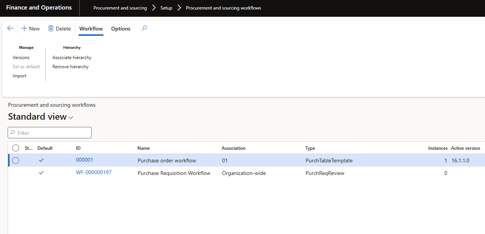

Association (Organization-Wide) => Organization wide means it applies to all the legal entities
Association (01) => 01 means it applies only to the selected legal entity.

We can also click on the NEW to create a new one. So let's try a new one 

>> Purchase Requisition Line Review (Use this type to create review workflows for purchase requisition lines) 

When we click on it , Microsoft downloads a package to our PC which Microsoft uses to edit the workflows called Workflow editor. Then launch it as it's a desktop app.


Then click on Properties to set some settings, condition , message etc.

Then we can use the left pane to add the controls to the Workflow. 

### FINANCE CORE CONCEPT IN D365 F&O

GENERAL LEDGER
- General Ledger is used to define and manage the legal entity's financial records.
- The general ledger is a register of debit and credit entities
- These entries are classified using the accounts that are listed in a chart of accounts.  
- Financial Structure  
      - Chart of accounts  
      - Account structure  
      - Financial dimensions  
      - Defining Fiscal Calendar   
-  It's the center of finance  
- FEATURES  
      -> Accruals   
            - Accruals are used in accrual accounting (Revenue recognition)   
            - to track revenue that is recognized in the period that ti's earned in, not when payment is received.  
            - to track expenses (costs) that are recognized when they occur, not when payment is made.  
      -> Allocation  
            - You can allocate or distribute, monetary amounts to one or more accounts or to account and dimension combinations, based on allocation rules.  
            -  Two types of allocations are fixed and variable.  
            -  You can also settle transactions between ledger accounts and revalue currency amounts.  
      -> Year-end closing process   
            - Close transactions  
            - Prepare accounts for next fiscal year  
            - Consolidation functionality  
      -> Financial Reporting 
            - Consolidate multiple companies during report generation      
            - These reports can be run anytime  
            - These reports provide ability to drill down to all companies and dimensions.

General Ledger Integration.
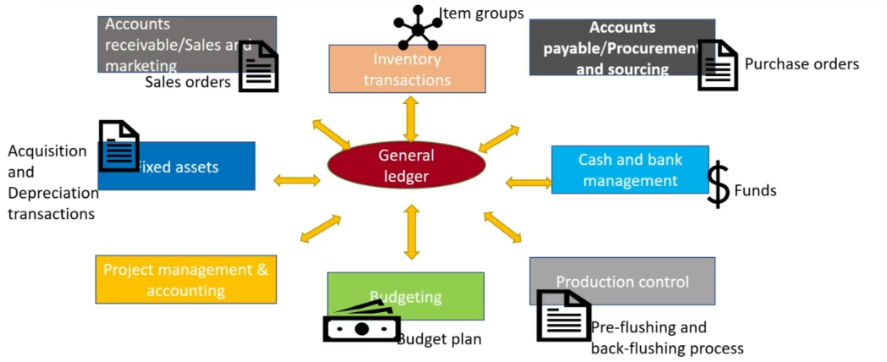  

Chart of Account
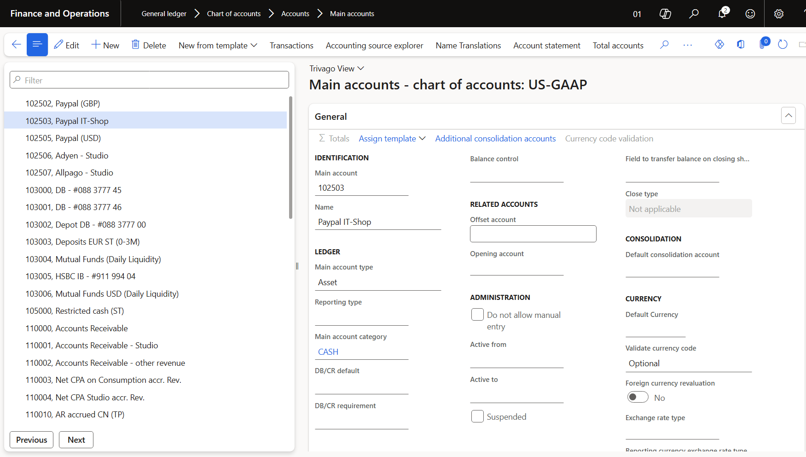

A main account is an account in the general ledger. It is used to record financial transactions, balances, or totals that pertain to assets, liabilities, revenues, expenses and owner equity. 

A chart of accounts (COA) is an index of all the financial accounts in the general ledger of a company.
        

CASH AND BANK MANAGEMENT
- Can be used to maintain the legal entity's bank accounts and financial instruments that are associated with those bank accounts.
- These instruments include deposit slips, checks, bills of exchange, and promissory notes.
- It can also be used for reconcile bank statements and print bank data on standard reports.

TAX 
The Sales tax framework supports many types of indirect taxes, such as 
- sales tax
- value-added-tax (VAT)
- goods and services tax (GST)
- unit-based fees
- withholding tax

These taxes are calculated and documented during purchase and sales transactions.
Periodically, they must be reported and paid to tax authorities.

ACCOUNTS PAYABLE
- Manage your vendor accounts
- Vendor invoices

ACCOUNT RECEIVABLE
- Track your customer invoices
- Manage their payments

CREDIT AND COLLECTION
- You can manage credit limits for your customers and perform collection activities when they become necessary.
  
BUDGETING 
 - It allows to capture required information to enable finance team to generate reports of Budget vs Actuals.
 - Also to control budget within the processes.

FIX ASSETS
 - Items of values such as vehicles, building , land which are owned by individuals or the company 
 - You can set up and enter acquisition information for fixed assets and then manage them by depreciating them and setting a capitalization threshold to determine depreciation.

COST ACCOUNTING
 - It lets you collect data from various sources ,such as the general ledger , sub-ledgers , budgets, and statistical information.

##### FINANCIAL DIMENSIONS

Financial dimensions are attributes (or tags) attached to financial transactions so organizations can track and report income and expenses in more detail than just the general ledger account.

Think of them as "labels" that answer questions about a transaction.

For example, imagine your company buys 10 laptops for €15,000.

The general ledger account tells you what the transaction is:

Account: Computer Equipment

Financial dimensions tell you more:

Department: IT  
Cost Center: Berlin Office   
Project: ERP Migration 
Employee: John Smith   
Business Unit: Europe   

So instead of just seeing:  

Account	Amount  
Computer Equipment	€15,000  

You see:  

Account	Department	Cost Center	Project	Amount
Computer Equipment	IT	Berlin	ERP Migration	€15,000


Financial dimensions in Dynamics 365 Finance & Operations (D365FO) are attributes you attach to financial transactions to slice and analyze data beyond just the main account number. They let you track "what," "where," and "who" behind a transaction without creating a separate ledger account for every combination.

How they work

A standard chart of accounts entry looks like: MainAccount-Dimension1-Dimension2-...

For example: 600100-001-CC500-P100 might mean:

600100 = main account (e.g., Travel Expense)
001 = legal entity/company
CC500 = cost center
P100 = project

Common dimension types  

Cost Center — which department/team incurred the cost   
Department — organizational unit   
Business Unit — division of the company   
Project — ties spend to a specific project   
Worker — links to an employee  
Customer/Vendor — sometimes used as a dimension for reporting   

Some are predefined (built into D365FO) like Department, Cost Center, and Business Unit. Others are user-defined — you can create custom ones (e.g., "Region" or "Product Line") to fit your business.   

Why they matter   

Reporting flexibility — you can run a P&L by cost center, by project, by region, etc., without duplicating main accounts.  
Account structures & advanced rules — D365FO uses "Account Structures" to define which dimension combinations are valid for a given main account, and "Advanced Rules" to restrict specific values further.  
Financial dimension sets — used to group dimensions for reporting or security purposes.  
Default dimensions — you can set defaults at the customer, vendor, item, or worker level so transactions auto-populate the right dimension values.  

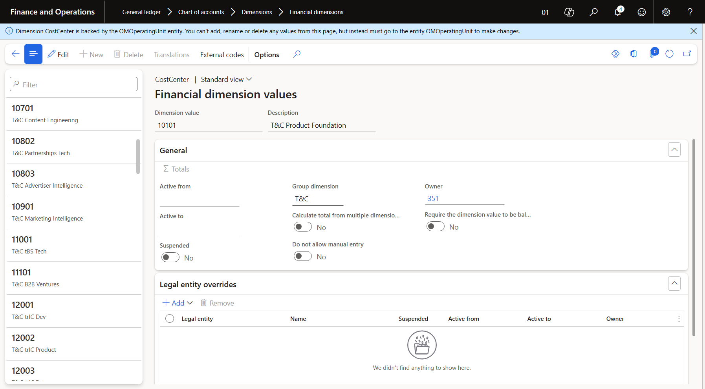

Currency is also under General Ledger i.e Exchange Rate

###### FISCAL CALENDAR SETUP  

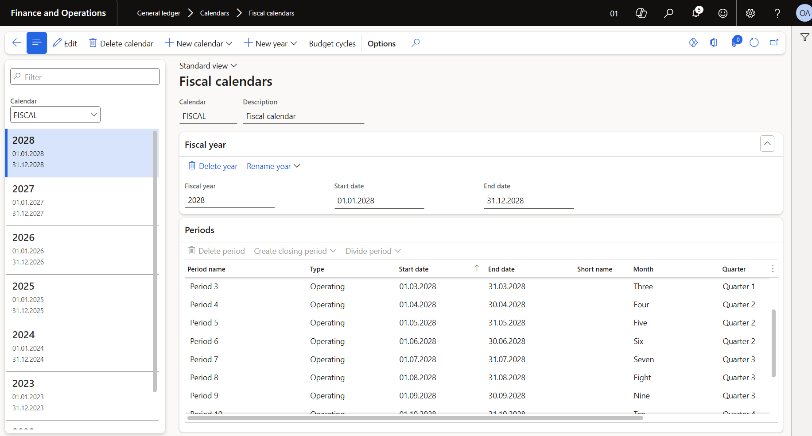